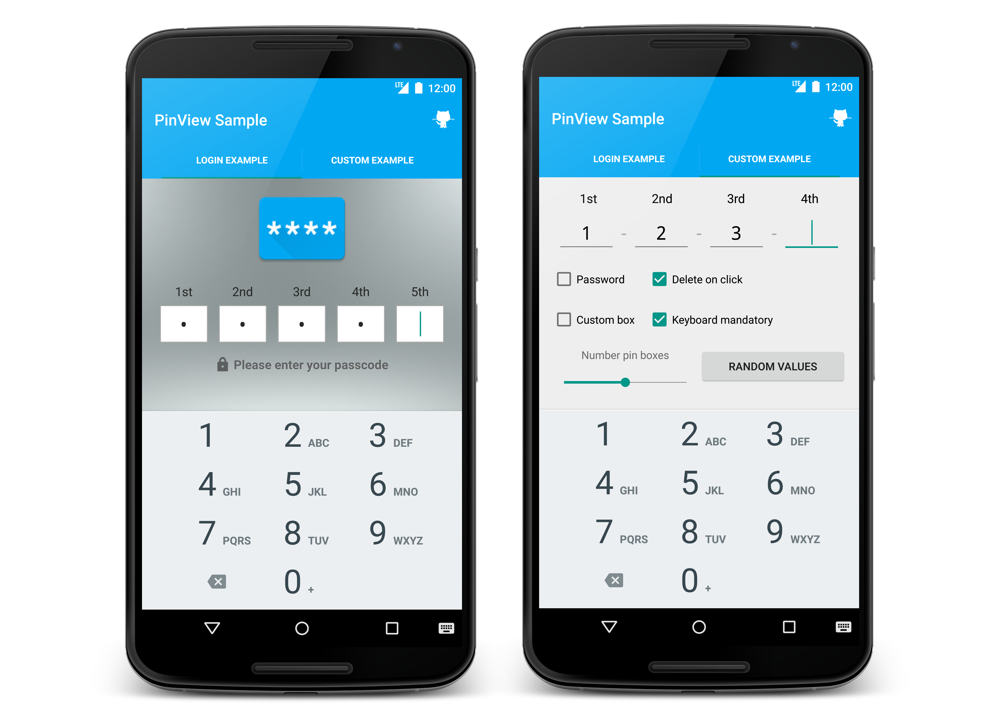

# PinView [](http://android-arsenal.com/details/1/2411) [](https://maven-badges.herokuapp.com/maven-central/com.github.davidpizarro/pinview)

A Pin view widget for Android. PinView has a feature that allows you to find out when they have completed all parameters. 
Support for Android 3.0 and up. It supports portrait and landscape mode, saving the state.



Try out the sample application on [Google Play][1].

<a href="https://play.google.com/store/apps/details?id=com.dpizarro.libraries.pinview">
  
</a>

Demo
=========================


Including in Your Project
=========================

Last version is 1.0.0

Just add the following statement in your build.gradle

    compile 'com.github.davidpizarro:pinview:VERSION'
    
You may also add the library as an Android Library to your project. All the library files live in ```library```.

Usage
=====

To add the PinView to your layout, add this to your xml
```xml
<com.dpizarro.pinview.library.PinView
        android:id="@+id/pinView"
        android:layout_width="match_parent"
        android:layout_height="wrap_content"/>
```  

You can add custom attributes in your xml to customize: pin boxes number, splits, number of characters in pin boxes, styles, mask password, titles, drawables, sizes, colors, behaviors...
```xml

<com.dpizarro.pinview.library.PinView
            android:id="@+id/pinView"
            android:layout_width="match_parent"
            android:layout_height="wrap_content"
            pinview:titles="@array/small_titles"
            pinview:password="true"
            pinview:numberPinBoxes="4"
            pinview:split="-"
            pinview:numberCharacters="2"
            pinview:deleteOnClick="false"
            pinview:keyboardMandatory="false"
            pinview:nativePinBox="false"
            pinview:textSizePinBox="@dimen/size_text_pinbox"
            pinview:textSizeTitles="@dimen/size_titles"
            pinview:drawablePinBox="@drawable/custom_pinbox"
            pinview:sizeSplit="@dimen/size_split"
            pinview:colorSplit="@color/color_splits"
            pinview:colorTextPinBox="@android:color/black"
            pinview:colorTextTitles="@color/color_title"/>
        
```
Review [attrs.xml][3] file to know the list of shapes ready to be used in the library.


This configuration can be also provided programmatically. You can use PinView programatically, using the Builder class to set the settings and the desired functionalities to make easy:
```java
PinView pinView = (PinView) view.findViewById(R.id.pinView);

PinViewSettings pinViewSettings = new PinViewSettings.Builder()
                                                     .withPinTitles(titlesAux)
                                                     .withMaskPassword(true)
                                                     .withDeleteOnClick(true)
                                                     .withKeyboardMandatory(false)
                                                     .withSplit("-")
                                                     .withNumberPinBoxes(5)
                                                     .withNativePinBox(false)
                                                     .build();

pinView.setSettings(pinViewSettings);
```

You can set/get values programatically:
```java
mPinView.setPin(5);
mPinView.setTitles(getResources().getStringArray(R.array.titles));
mPinView.setMaskPassword(true);
mPinView.setDeleteOnClick(true);
mPinView.setNativePinBox(true);
mPinView.setCustomDrawablePinBox(R.drawable.pin_box);
mPinView.setKeyboardMandatory(false);
mPinView.setSplit("**");
mPinView.setColorTitles(Color.rgb(255, 0, 128));
mPinView.setColorTextPinBoxes(Color.rgb(200, 57, 222));
mPinView.setColorSplit(Color.rgb(0, 0, 0));
mPinView.setSizeSplit(getResources().getDimension(R.dimen.size_split));
mPinView.setTextSizePinBoxes(getResources().getDimension(R.dimen.size_pinboxes));
mPinView.setTextSizeTitles(getResources().getDimension(R.dimen.size_titles));
```

We can use a Listener to notify us when we could do Login and the returned value. You will need to implement `OnCompleteListener` interface.
```java
pinView.setOnCompleteListener(new PinView.OnCompleteListener() {
            @Override
            public void onComplete(boolean completed, final String pinResults) {
                //Do what you want
                if (completed) {
                    doLogin(pinResults);
                }
            }
        });
```

Or browse the [source code of the sample application][2] for a complete example of use.

Contribution
============

#### Pull requests are welcome!

I'd like to improve this library with your help!
If you've fixed a bug or have a feature you've added, just create a pull request. Issues can be reported on the github issue tracker.

Author
-------

David Pizarro (dpizarro89@gmail.com)

<a href="https://plus.google.com/u/0/110797503395500685158">
  
</a>
<a href="https://twitter.com/DavidPizarro89">
  
</a>
<a href="https://www.linkedin.com/in/davidpizarrodejesus">
  
</a>


License
-------

    Copyright 2015 David Pizarro

    Licensed under the Apache License, Version 2.0 (the "License");
    you may not use this file except in compliance with the License.
    You may obtain a copy of the License at

       http://www.apache.org/licenses/LICENSE-2.0

    Unless required by applicable law or agreed to in writing, software
    distributed under the License is distributed on an "AS IS" BASIS,
    WITHOUT WARRANTIES OR CONDITIONS OF ANY KIND, either express or implied.
    See the License for the specific language governing permissions and
    limitations under the License.
---

[1]: https://play.google.com/store/apps/details?id=com.dpizarro.libraries.pinview
[2]: https://github.com/DavidPizarro/PinView/tree/master/app
[3]: https://github.com/DavidPizarro/PinView/blob/master/library/src/main/res/values/attrs.xml
